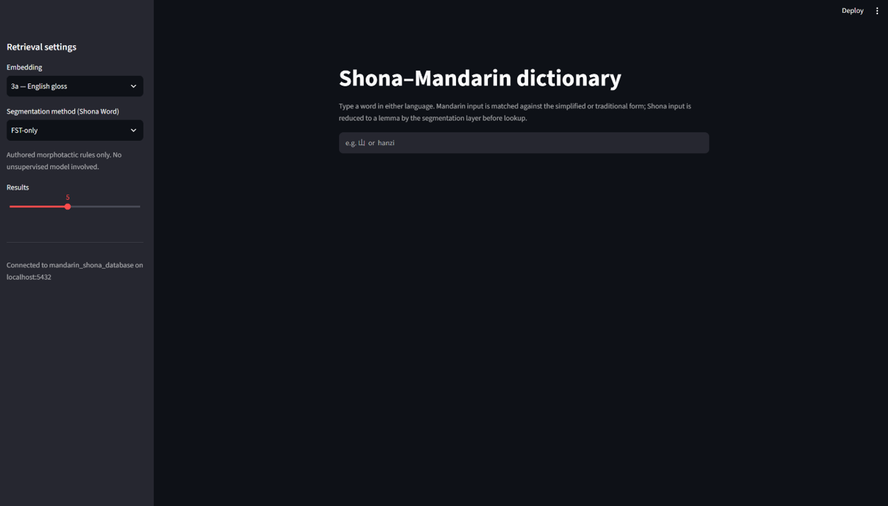
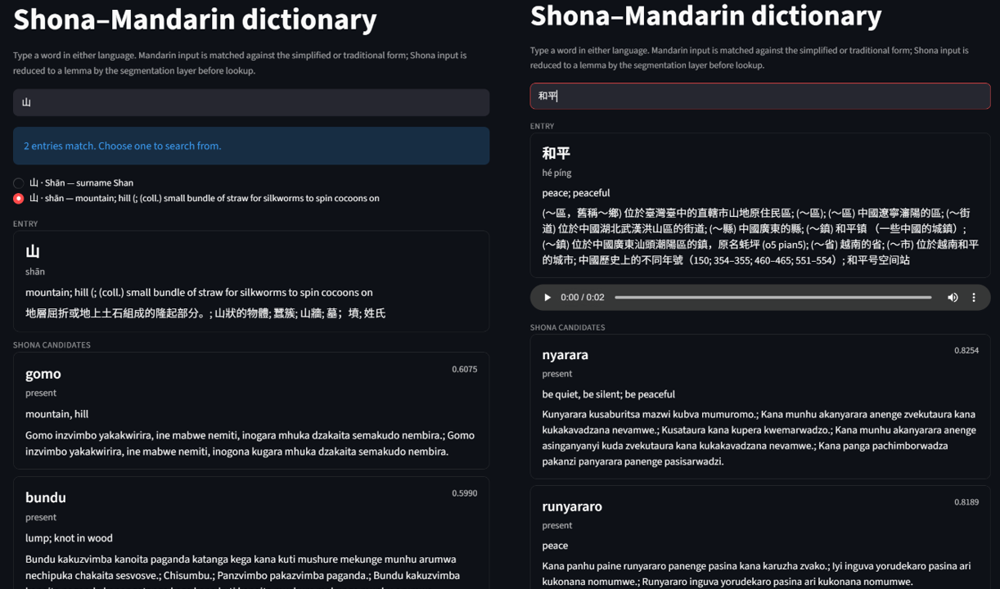
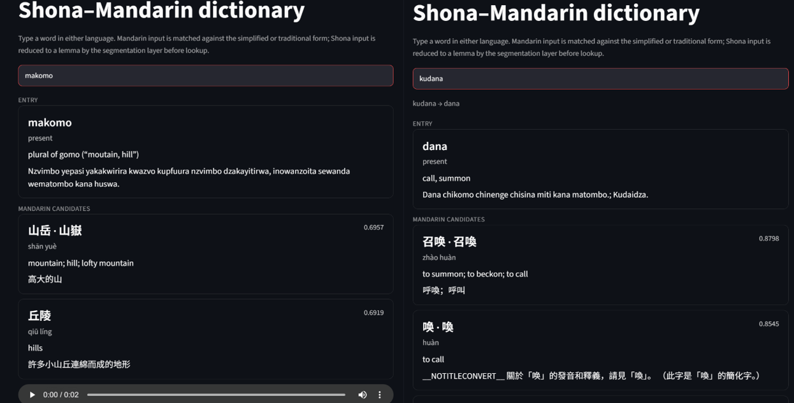

# Shona-Mandarin Dictionary Prototype

An end-to-end NLP dictionary system that provides cross-lingual retrieval, segmentation, and vector embeddings between Shona and Mandarin Chinese.

---

## 📌 Project Overview

This repository contains preprocessing code, segmentation methods, vector embedding pipelines, evaluation notebooks, and a web interface for searching and querying Shona-Mandarin translations.

Raw datasets and corpora used by the project are **not included in this repository**. They should be downloaded separately from their original sources as described below.

---

## 📁 Repository Structure

```text
├── Database/
│   └── mandarin_shona_dictionary_database.7z    # Shona and Mandarin database
│
├── Preprocessing/
│   ├── shona_preprocessing.ipynb                        # Shona text cleaning and normalization
│   ├── shona_segmentation_methods.ipynb                 # Segmentation algorithm experiments
│   ├── shona_embedding.ipynb                            # Vector embedding generation for Shona
│   ├── mandarin_preprocessing_v2.ipynb                  # Mandarin text tokenization & processing
│   ├── mandarin_embedding_v2.ipynb                      # Vector embedding generation for Mandarin
│   ├── shona_segmentation_boundary_evaluation.ipynb     # Evaluation of Boundaries Shona Segmented Word
│   └── shona_mandarin_evaluation.ipynb                  # Evaluation metrics and model performance
│
└── Interface/
    ├── app.py                   # Main application entry point (Streamlit / Flask)
    ├── db.py                    # Database connection & query execution
    ├── retrieval.py             # Vector similarity search and retrieval logic
    ├── segmentation.py          # Master segmentation handler
    ├── shona_segmenters.py      # Custom Shona word/morpheme segmenter implementations
    ├── flatcat_model.tar.gz     # Trained segmentation/morphological model
    ├── requirements.txt         # Python dependencies
    └── env.example              # Environment variables template
```

---

## 🖥️ Demo



<br>

*Example: Interface allow user change the retrieval dataset, Shona word segmentation method, and number of result.*

<br>



<br>

*Example: Mandarin word input example.*

<br>



<br>

*Example: Shona word input example.*

<br>

---

## 📚 Data Sources

The datasets used to build and evaluate the prototype are not distributed with this repository. Please download them directly from their original sources.

### Shona

- **Leipzig Corpora Collection – Shona (Zimbabwe) Web Corpus, 2018, 100K**  
  Download the **Web 2018 100K** version (`sna-zw_web_2018_100K`) from:  
  https://wortschatz-leipzig.de/en/download/sna#sna-zw_web_2018_100K

- **Kaikki.org Shona Dictionary Data**  
  Shona lexical and word-form data derived from Wiktionary:  
  https://kaikki.org/dictionary/Shona/words/index.html

- **Duramazwi Dictionaries**  
  Authoritative published Duramazwi dictionary sources were used for Shona lexical definitions and validation where available.

### Mandarin Chinese

- **CC-CEDICT**  
  Mandarin Chinese-English dictionary data:  
  https://www.mdbg.net/chinese/dictionary?page=cc-cedict

- **zi-dataset**  
  Chinese character-level lexical and structural information:  
  https://github.com/secsilm/zi-dataset

- **HSK Dataset**  
  HSK vocabulary and associated information:  
  https://huggingface.co/datasets/willfliaw/hsk-dataset

- **Kaikki.org Chinese Dictionary Data**  
  Chinese lexical data derived from Wiktionary:  
  https://kaikki.org/dictionary/Chinese/index.html

### Dataset Availability

Due to dataset size, licensing, and redistribution considerations, the original dataset archives are not stored in this repository. Users wishing to reproduce the preprocessing and evaluation pipeline should obtain the datasets from the sources above before running the corresponding notebooks.
